# LBC Rider — User Manual

**Version 1.3 | Platform: Android**

Welcome to the **LBC Rider** field operations guide. This manual is your end-to-end reference for picking up your daily orders at the hub, building your delivery **manifest**, completing your route, and returning safely. Keep it handy during your first shifts and revisit it whenever you face an unfamiliar situation in the field.

> ⚠️ **CRITICAL:** Never operate the **LBC Rider** app while your vehicle is in motion. Always pull over to a safe, legal stopping point before tapping any button, scanning a barcode, or reading a notification.

---

## Table of Contents

1. [Introduction & Shift Setup](#1-introduction--shift-setup)
2. [Interface Anatomy (The Rider Dashboard)](#2-interface-anatomy-the-rider-dashboard)
3. [The Delivery Lifecycle](#3-the-delivery-lifecycle-step-by-step)
4. [Handling Field Exceptions](#4-handling-field-exceptions)
5. [End of Trip, Shift Summary & Sign-Out](#5-end-of-trip-shift-summary--sign-out)
6. [Troubleshooting & Quick FAQ](#6-troubleshooting--quick-faq)
7. [Emergency & Support](#7-emergency--support)

---

## 1. Introduction & Shift Setup

The **LBC Rider** app is your single workspace for the entire delivery day. **LBC Rider works on a hub-based manifest model**: you start your shift physically at an LBC hub, download the orders available there, build your own delivery **manifest**, confirm it, and then execute an **optimized multi-stop route**. The app keeps working even when you lose signal in the field.

### 1.1 Before You Hit the Road — System Check

Run this 60-second check at the **start of every shift**. Skipping it is the single biggest cause of failed deliveries.

1. **Charge your phone to at least 80%** and keep a power bank or vehicle charger within reach.
2. Open **Settings → Location** and confirm **Location Services** are set to **"Always Allow"** for **LBC Rider**.
3. Confirm **Mobile Data** is ON and you have at least **3 bars** of signal (or active Wi-Fi at the hub).
4. Confirm **Notifications** are enabled for **LBC Rider** so you do not miss dispatcher messages or route updates.
5. Make sure your **phone mount** is secure and the screen is clearly visible from the driver's seat.
6. Do a quick walk-around of your vehicle — fuel, tires, lights, delivery box / thermal bag.

> ⚠️ **CRITICAL:** Location permission **must** be set to **"Always Allow"**. The app uses your GPS at 2 security gates: **(1)** to verify you are at the hub when you **Check In** at the start of your shift, **(2)** to verify you are at each delivery address (within 100 m) before opening the **Proof of Delivery (POD)** screen.

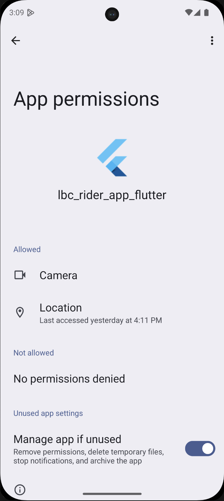

### 1.2 Clocking In — Sign In and Check In at the Hub

Starting your shift is a **two-step process**:

1. **Sign In** with your email + password (first time only) or your **4-digit PIN** (every other day).
2. **Check In** at the hub — the app verifies via GPS that you are physically inside the hub's radius before unlocking your work.

The two steps are intentionally separate: you can sign in from anywhere, but you cannot start working until you have checked in at the hub.

#### 1.2.1 First-Time Sign-In (One-Time Setup)

The first time you ever open the app — or any time your account is reset by dispatch — you need your **email address** and **password**.

1. Unlock your phone and tap the **LBC Rider** icon on your home screen.
2. On the **Sign In** screen, enter your registered **Email** and **Password**. Use the eye icon to peek at your password if needed.
3. Tap **Sign In**.
4. The app routes you to the **Set Your PIN** screen.
5. Enter a **4-digit PIN** you will remember. Tap **Continue**.
6. Re-enter the same PIN to confirm. Tap **Confirm PIN**.
7. The app then routes you to the **Attendance / Check-In** screen (see [1.2.4](#124-attendance--check-in-at-the-hub)).

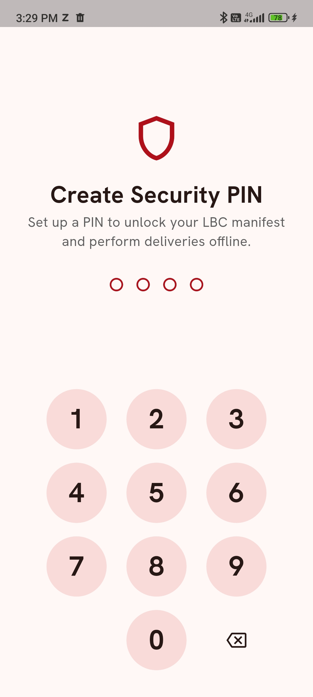
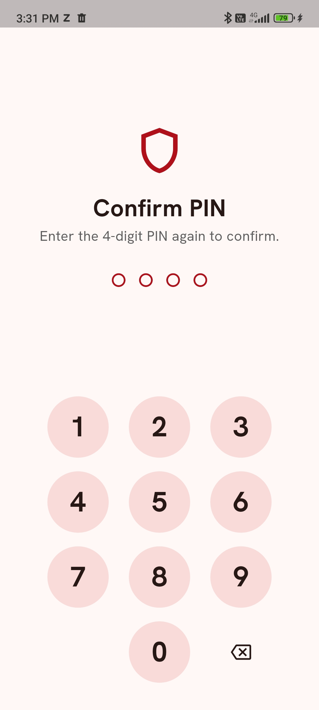

> ⚠️ **CRITICAL:** Your **4-digit PIN** is personal. **Never** share it with another rider, hub staff, or anyone claiming to be from LBC support. LBC will never ask for your PIN.

> 💡 **Tip:** Pick a PIN you can enter quickly with gloves on, but avoid obvious choices like `1234`, `0000`, or your birth year.

#### 1.2.2 Returning Sign-In (Token Still Valid — Daily Use)

This is your normal day-to-day sign-in. As long as your session token has not expired, you only need your PIN.

1. Tap the **LBC Rider** icon. The **Enter PIN** screen appears.
2. Enter your **4-digit PIN**.
3. The app routes you to the **Attendance / Check-In** screen if you have not yet checked in today (see [1.2.4](#124-attendance--check-in-at-the-hub)), or directly to the **Home** tab if you have already checked in today.

> 💡 **Tip:** If you mistype your PIN, just retype. Persistent failure means your token may have expired — see [1.2.3](#123-when-your-session-token-has-expired).

#### 1.2.3 When Your Session Token Has Expired

Session tokens expire periodically for security (e.g., after a long stretch of inactivity, an app update, or a manual sign-out). When this happens, the PIN screen is replaced by the full **Sign In** form.

1. The app shows the **Sign In** screen again.
2. Enter your **Email** and **Password**.
3. Tap **Sign In**.
4. After a successful sign-in, **your existing 4-digit PIN is preserved** — you are **not** asked to set a new one. Your next sign-in will go straight back to the PIN screen.

#### 1.2.4 Attendance / Check-In at the Hub

The first time each day that you sign in (PIN or email + password), the app routes you to the **Attendance** screen to check in. **This is the step where the hub geofence is enforced — not the sign-in step.**

1. The app shows a **"Locating you…"** spinner and asks for **Location** permission if it has not been granted (grant **Always Allow**).
2. Your current GPS coordinates are read and displayed on the card.
3. Tap **Check In**.
4. The server compares your GPS position against your assigned hub's radius:
  - ✅ **Inside hub radius** → A success animation plays, **"Checked in"** is recorded for today, and you are routed to the **Home** tab.
  - ❌ **Outside hub radius** → An error card appears (e.g., **"Too far from hub"** with the distance shown). Move closer to the hub building and tap **Try Again**.
5. If the app cannot get your location at all (permission denied, GPS off), you see a **Location required** card with a **Retry** button.

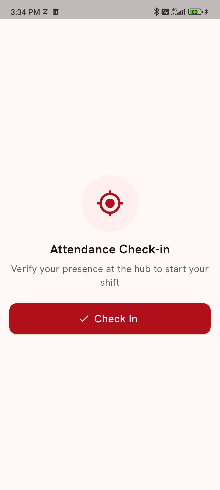
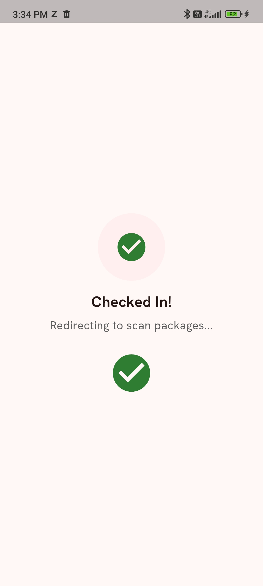

> ⚠️ **CRITICAL:** Do **NOT** attempt to spoof or mock your GPS location to bypass the hub check. Mock-location attempts are logged and may result in immediate account suspension.

> 💡 **Tip:** If the hub building has poor GPS reception (e.g., metal roof), step outside the main door for 10 seconds and tap **Try Again**. Check-in is much more reliable in open sky.

Once you are checked in, you do not need to check in again until tomorrow — even if you close and reopen the app. Closing and reopening will take you straight to the **Home** tab after PIN entry.

#### 1.2.5 Forgot Password or Forgot PIN

- **Forgot Password:** On the **Sign In** screen, use the **Forgot Password?** link (if shown) or contact dispatch (see [Section 7](#7-emergency--support)) to request a reset.
- **Forgot PIN:** On the **Enter PIN** screen, switch back to **Sign In with Email & Password**. After a successful email + password sign-in, you will be prompted to **set a new 4-digit PIN** exactly as in first-time setup.

---

## 2. Interface Anatomy (The Rider Dashboard)

After you check in for the day you land on the **Home Shell** — a four-tab layout driven by a **bottom navigation bar**. A persistent **Top App Bar** runs across the top of every tab and surfaces sync status.

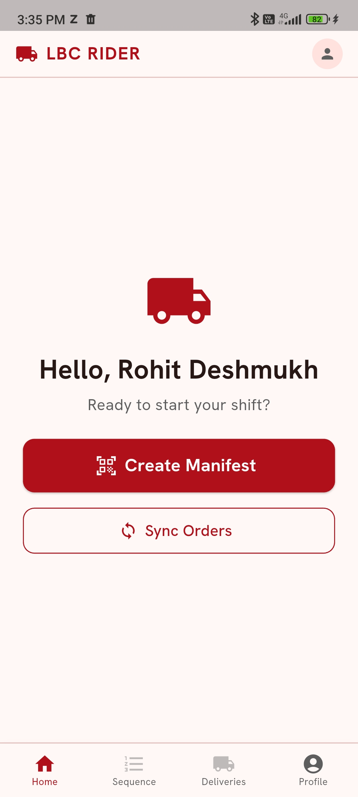

### 2.1 The Top App Bar (shown on every tab)

| Element                                      | Position                 | What it does                                                                                                                                                         |
| -------------------------------------------- | ------------------------ | -------------------------------------------------------------------------------------------------------------------------------------------------------------------- |
| **LBC RIDER** wordmark + delivery-truck icon | Top left                 | Brand identifier. Not tappable.                                                                                                                                      |
| **Profile avatar** (circular person icon)    | Top right                | Reserved for future use. To open your profile, use the **Profile** tab on the bottom bar.                                                                            |
| **Connectivity Banner**                      | Just below the title bar | A coloured strip that appears **only when relevant** (offline, syncing, or pending sync). Hidden when everything is healthy. See [2.3](#23-the-connectivity-banner). |

### 2.2 The Bottom Navigation Bar

The bottom bar has four tabs. Two of them — **Sequence** and **Deliveries** — are **locked until you create a manifest**; their icons appear faded and tapping them shows the snackbar **"Create a manifest first to access this tab."**

| Tab            | Icon          | Always available?                           |
| -------------- | ------------- | ------------------------------------------- |
| **Home**       | House         | ✅ Yes                                       |
| **Sequence**   | Numbered list | 🔒 Locked until you have an active manifest |
| **Deliveries** | Truck         | 🔒 Locked until you have an active manifest |
| **Profile**    | Person        | ✅ Yes                                       |

#### Home Tab

The starting point and the only screen you see before creating a manifest.

- Greeting: **"Hello, `[Your Name]`"**.
- If you have an **active manifest**, you see an **Active Manifest card** with:
  - A green **"Active"** badge and your **Manifest ID**.
  - A 4-tile stat grid: **Total / Done / Left / Failed**.
  - A hint: *"Switch to Sequence tab to manage deliveries."*
- If you have **no active manifest**, you see:
  - **"Ready to start your shift?"**
  - A large red **Create Manifest** button (with a QR-scanner icon) that opens the **Scan** screen.
- Below either state: a **Sync Orders** outlined button. Tap it to refresh your **offline cache** of available orders. It is disabled while offline (showing **"Internet required to sync"**) and displays **"Last synced: MMM D, h:mm AM/PM"** after a successful sync.

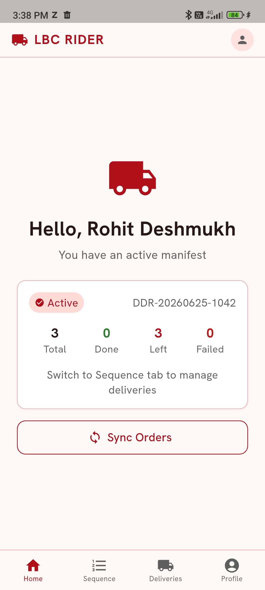

> 💡 **Tip:** Tap **Sync Orders** at the hub. The cached list is what powers manual entry on the **Scan** screen when you lose signal.

#### Sequence Tab (locked until manifest exists)

This is your live route. Pick a stop here to start delivering it.

- **Summary card** at the top: **Current Route** label, your Manifest ID, an "Active" status chip, and counts (**Total / Completed / Remaining**).
- **View toggle**: **List View** | **Map View** | **Reorder**.
  - **List View** shows every stop as a card.
  - **Map View** shows the optimized route as a polyline with numbered pins.
  - **Reorder** lets you drag stops into a new sequence; an **Optimize** button re-runs route optimization, and **Save Order** commits the new sequence.
- **Filter tabs**: **All** | **Pending** | **Completed** | **Failed**.
- Each **Stop card** shows: sequence number, recipient name, address, tracking number, COD amount, status chip, and quick actions to **Call** and **Navigate**.
- Tapping a stop opens the **Active Route** screen for that stop, where you can navigate and tap **Arrived**.

A small **AI Assistant** floating button (sparkle icon) is draggable around this tab. Tap it to ask the in-app assistant questions about your route or app usage.

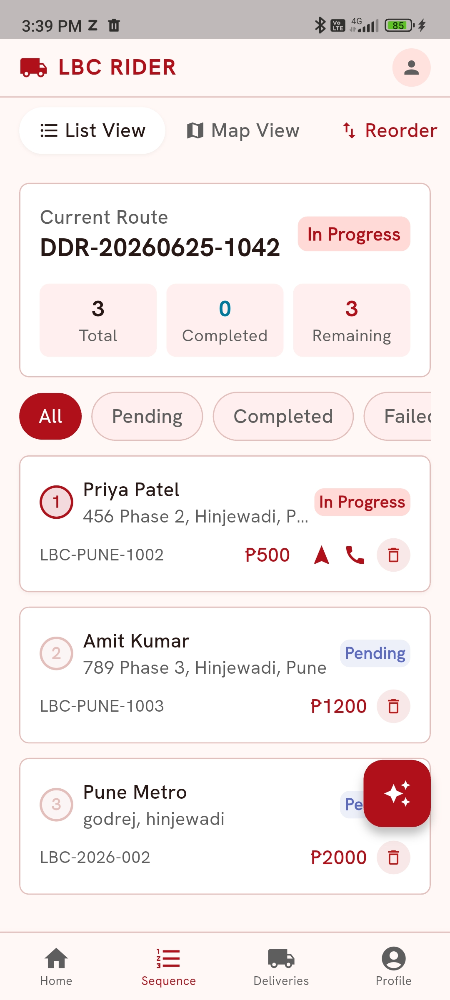
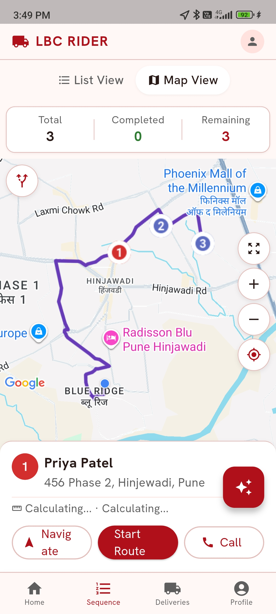

> 💡 **Tip:** The AI Assistant is for **app questions** (e.g., "How do I mark a delivery failed?"), not for emergency dispatch. For dispatch use the hotline — see [Section 7](#7-emergency--support).

#### Deliveries Tab (locked until manifest exists)

A read-only log of every resolved stop.

- **Search bar**: *"Search Tracking No. or Recipient"*.
- **Stat grid**: **Total Stops / Delivered / Failed / Returned**.
- **Filter tabs**: **All** | **Delivered** | **Failed** | **Returned** | **Rescheduled**.
- Section header: **Today**.
- Each entry shows a status dot (✓ delivered, ✕ failed, 📅 rescheduled, ↩ returned), the stop number, completion time, recipient name, address, tracking number, and either the **COD collected** (for delivered) or the **failure reason and attempt count** (for failed).

#### Profile Tab

Your identity, today's stats, history, and sign-out.

- **Profile picture** placeholder + your **Name** and **Employee ID**.
- **Info card**: **Hub**, **Zone**, **Email**, **Phone**, **Vehicle**.
- **Today's Shift** card with **Total / Completed / Failed / Remaining** tiles.
- **Past Manifests** list — tap any past manifest to expand a per-day breakdown with a **completion-rate progress bar**.
- **App info** card: **App Version** and **Build**.
- **Sign Out** button (red outlined) at the bottom.

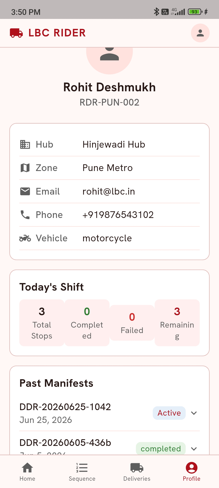
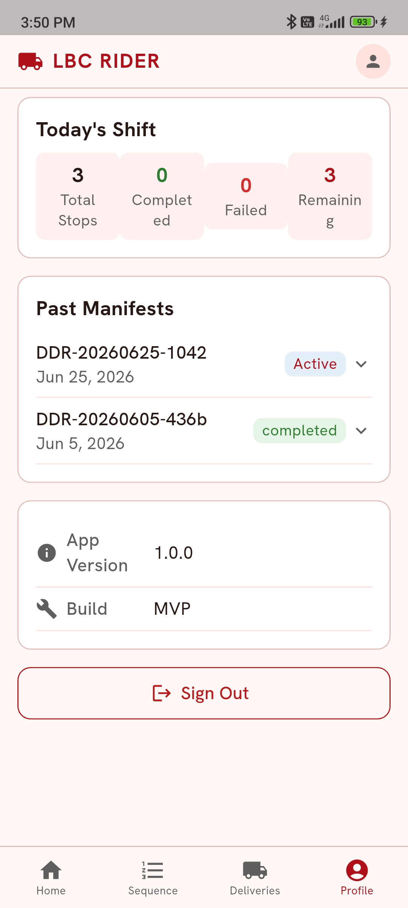

### 2.3 The Connectivity Banner

A coloured strip that appears just under the top app bar **only when you need to know about it**. When no banner is showing, you are online with nothing pending.

| Banner Text                                      | Colour                               | What it means                                                                                                                            |
| ------------------------------------------------ | ------------------------------------ | ---------------------------------------------------------------------------------------------------------------------------------------- |
| **"Offline — changes will sync when connected"** | Amber/orange with a cloud-off icon   | You have no internet. Most actions still work and queue locally.                                                                         |
| **"Back online — syncing `N` action(s)…"**       | Blue with a spinner                  | You're back online and queued actions are uploading.                                                                                     |
| **"`N` action(s) pending sync"**                 | Dark orange with a sync-problem icon | You're online but queued actions have not auto-flushed yet. They normally retry automatically; sign-out will be blocked until they sync. |

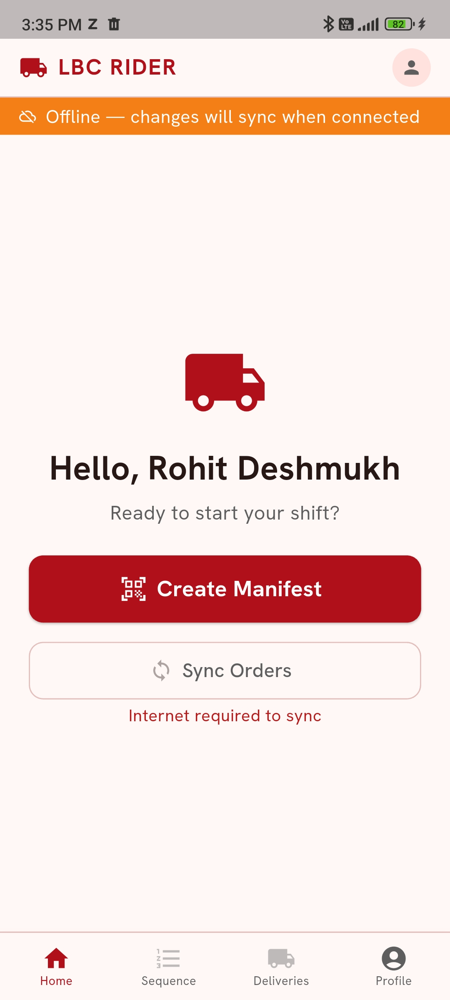

> 💡 **Tip:** Glance at the banner before every critical action — creating a manifest, completing a delivery — so you always know whether your action will hit the server immediately or queue locally.

### 2.4 Geofence Override at Delivery Stops

When you tap **Arrived** on the **Active Route** screen, the app checks that you are **within 100 m** of the delivery address. If you are further away, a **Too Far From Stop** modal appears showing your distance.

You can either:

- Tap **Move Closer** (recommended) — close the modal, walk to the address, and tap **Arrived** again, **OR**
- Pick an **Override Reason** and proceed to POD anyway. The override and the reason are logged for dispatch review.

The four override reasons offered are:

- *GPS signal is weak in this area*
- *I am at the correct location*
- *Customer asked to meet nearby*
- *Building entrance is far from pin*

> ⚠️ **CRITICAL:** Geofence overrides are reviewed by dispatch. Use them only when one of the four legitimate reasons truly applies — never as a shortcut.

---

## 3. The Delivery Lifecycle (Step-by-Step)

A complete shift moves through five stages: **Sync Orders → Build & Create Manifest → Navigate Route → Deliver → Resolve Outcome**. Follow these procedures exactly — they are designed to protect you, the parcels, and your shift record.

### Task 1: Sync Orders (Cache the Hub's Available Orders)

Before you build a manifest, sync the orders available at the hub onto your phone so the rest of the workflow keeps working if signal drops.

1. On the **Home** tab, tap the **Sync Orders** button.
2. The button label changes to **"Syncing…"** with a small spinner.
3. On success, a snackbar appears: **"Synced `X` orders"** and the caption below the button updates to **"Last synced: MMM D, h:mm AM/PM"**.
4. If you are offline, the button is disabled and shows **"Internet required to sync"** in red below it — connect to internet first.

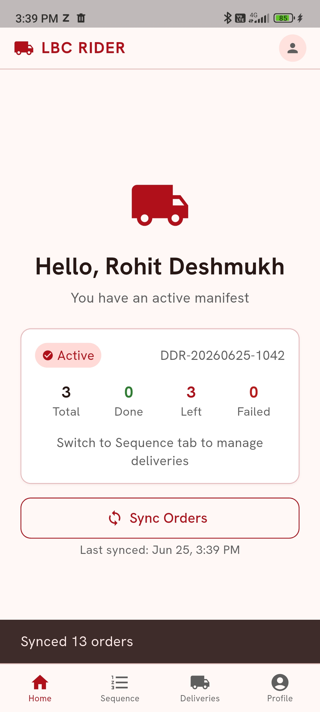

> 💡 **Tip:** Tap **Sync Orders** again any time fresh orders may have arrived in the hub. The cached list is what powers manual-entry autocomplete when you go offline.

### Task 2: Build & Create the Manifest (Scan Screen)

The **manifest** is the list of orders you are physically taking with you on this trip. Building and creating it happen on a single **Scan** screen, which you reach from the red **Create Manifest** button on the **Home** tab.

1. On the **Home** tab, tap **Create Manifest**. The **Scan** screen opens with the in-app barcode camera active by default.

#### Method A — Scan Barcode (preferred)

1. The camera view appears with a centered framing rectangle and the hint **"Point camera at barcode"**.
2. Center the parcel's barcode inside the frame.
3. The scanner auto-captures — your phone **vibrates** briefly on success and a toast appears: **"Added: `[Recipient Name]`"**.
4. The scanned parcel is added to the list below with its tracking number, recipient, address, and COD amount (if any).
5. The scanner stays armed for the next parcel — keep scanning until every parcel is added.

If the scanner shows **"Already scanned: `[tracking]`"**, the order is already on your list — skip it. If it shows **"Order not found"**, switch to Manual Entry.

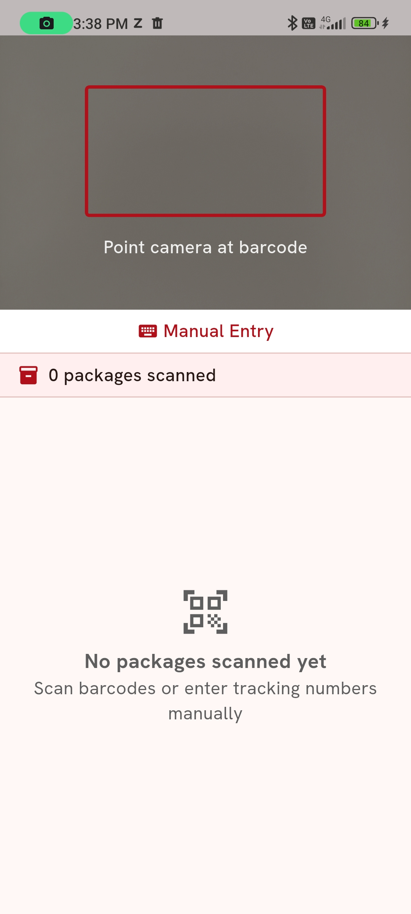

#### Method B — Manual Entry (when the barcode is damaged or unreadable)

1. Below the camera, tap the **Manual Entry** link (keyboard icon).
2. The camera view is replaced by a text field labelled **Enter Tracking Number** (placeholder: *e.g. LBC-2025-0001*).
3. Start typing. An auto-complete dropdown appears with matching available orders, each row showing tracking number, recipient name, address, and any COD amount in a red pill.
  - 🟢 **Online:** the list comes from a live API call — always the freshest data.
  - 🟡 **Offline:** the list comes from the orders you cached earlier with **Sync Orders** — limited to what was in the hub at last sync. If no orders match in offline mode you'll see **"No available packages found"** or **"Order not found in offline cache — try syncing first"**.
4. Tap the matching row in the dropdown to add it to the list — or type the full tracking number and tap the red **+** button to look it up directly.
5. To switch back to the camera, tap the **camera icon** in the top right of the manual-entry header.

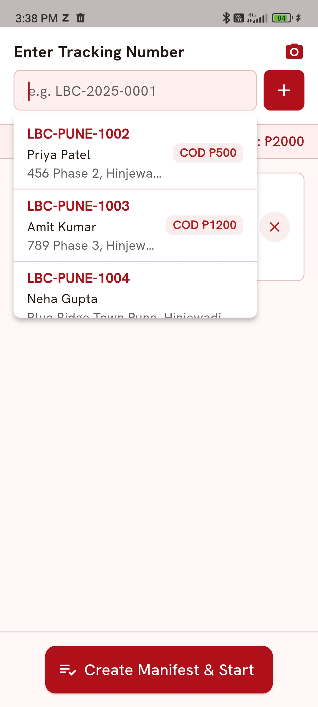

A summary strip below the input shows **"`X` packages scanned"** and the running **COD total**. Tap the red **✕** on any scanned row to remove a parcel before creating the manifest.

> ⚠️ **CRITICAL:** Add an order to your manifest **only when the physical parcel is in your hand**. A manifest entry without the matching parcel will appear as a missing/lost parcel at the end of your shift, and you may be held responsible.

> 💡 **Tip:** If the in-app scanner struggles in low light, tilt the phone 15° to kill glare. If a barcode still refuses to scan after two tries, switch to **Manual Entry** rather than wasting time.

Inspect each parcel briefly for **visible damage, leaks, or open seals** before scanning. If anything looks wrong, do **not** add the parcel — follow the [Damaged Packages](#42-damaged-packages-at-the-hub) protocol instead.

#### Create Manifest & Start (Internet Required)

When all parcels are scanned, a fixed action bar at the bottom shows the large red **Create Manifest & Start** button. This single action **submits your manifest, locks the orders to you, runs route optimization, and starts your trip** in one step.

1. Tap **Create Manifest & Start**.
2. The button changes to **"Creating…"** while the server processes.
3. **Online success** → you are routed back to the **Home** tab; the **Sequence** and **Deliveries** bottom-nav tabs unlock and your route is ready.
4. **Offline** → the button is disabled and a red warning above it reads **"Internet required to create manifest"**. Your scanned list is preserved — move to better signal and try again.
5. On a server error you see a snackbar (e.g., **"Failed to create manifest"**) with the specific reason.

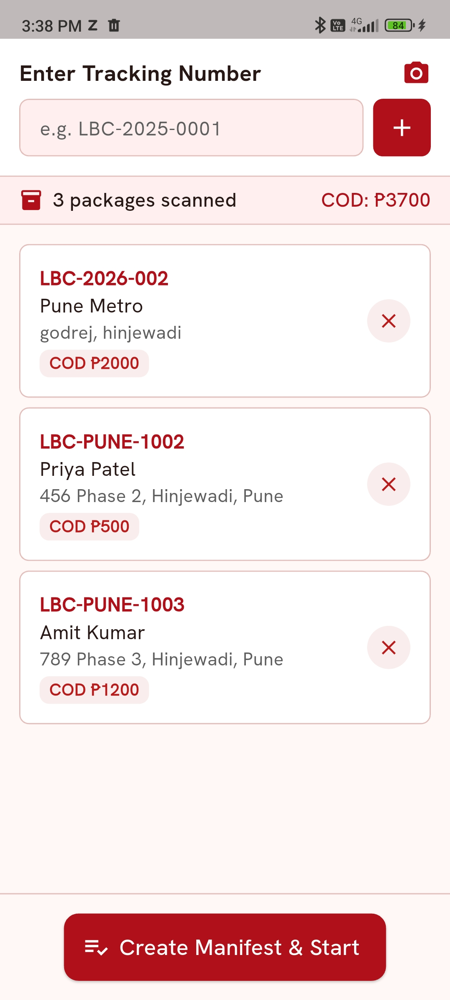

> ⚠️ **CRITICAL:** You cannot create a manifest while offline. If signal at the hub is unreliable, walk to a known signal spot (e.g., the hub's main entrance) **before** tapping **Create Manifest & Start**.

### Task 3: Navigating Your Route (Sequence Tab)

After the manifest is created, the **Sequence** tab unlocks and contains your optimized route.

1. Tap the **Sequence** tab on the bottom nav.
2. Stops appear in **optimized order** (Stop 1, Stop 2, Stop 3, …). The **List View** shows each stop as a card; **Map View** shows the route as a polyline with numbered pins.
3. Tap the **next pending stop** to open the **Active Route** screen for it.
4. On the **Active Route** screen, tap the navigation action to launch turn-by-turn navigation in **Google Maps**.
5. When you arrive near the stop, return to the app and tap **Arrived** — see [Task 4](#task-4-delivering-an-order-geofenced-pod).

If you genuinely need a different sequence (e.g., a customer asks you to come earlier), use the **Reorder** view on the Sequence tab to drag stops or tap **Optimize** to re-run optimization, then **Save Order**.

> ⚠️ **CRITICAL:** Always follow the **optimized route order** unless you have a customer-driven reason to reorder. Skipping stops on your own breaks the route's ETA calculations and may delay other customers on your manifest.

### Task 4: Delivering an Order (Geofenced POD)

1. On the **Active Route** screen for the current stop, tap **Arrived**.
2. The app reads your GPS and checks distance to the drop-off:
  - ✅ **Within 100 m** → the **Stop Detail** screen opens, with the recipient card, address, and a **Confirm Delivery** action.
  - ❌ **More than 100 m away** → the **Too Far From Stop** modal appears showing your distance (see [Section 2.4](#24-geofence-override-at-delivery-stops)). Choose **Move Closer** to retry, or pick an **Override Reason** to proceed anyway (logged for dispatch review).
3. On the **Stop Detail** screen, review the recipient information. Use the round **Call** button (phone icon) to ring the customer.
4. When you meet the customer, hand over the parcel(s). For **COD** orders, collect the exact amount shown on the screen first.
5. Tap **Confirm Delivery** to open the POD workflow.

#### Step A — Capture Digital Signature

1. In the **Signature** card, hand the phone to the customer and ask them to **sign with their finger** in the signature box.
2. The signature is captured automatically as they sign. Tap **Clear** if it is unclear and ask them to try again.

#### Step B — Capture Proof-of-Delivery Photo

1. In the **Photo** card, tap the camera icon.
2. The in-app camera opens. Frame the photo so it shows:
  - The **parcel** clearly
  - The **front door / gate / reception desk** in the background (for location proof)
3. Tap the shutter, review the preview, and tap **Use Photo** (or **Retake**).

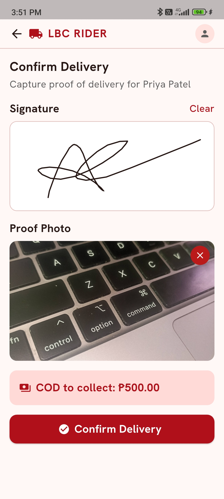

#### Step C — Submit the Delivery

1. Tap the large green **Submit / Complete Delivery** button at the bottom of the screen.
2. **Online** → the server records the delivery and the app routes you to the next pending stop in your sequence (or back to the **Home** tab if this was the last stop).
3. **Offline** → the delivery is **saved locally and queued for sync**. A "Saved offline" indicator appears, and the **Connectivity Banner** will show the pending count until you regain signal.

> ⚠️ **CRITICAL:** Do **NOT** tap **Submit / Complete Delivery** until the parcel has physically left your hands and is with the recipient (or safely placed per "Leave at Door" instructions). Premature completion is treated as fraud.

> 💡 **Tip:** For **"Leave at Door"** orders where the customer is not present, photograph the parcel **on the doorstep with the house number visible**. This is your strongest defence against false "not delivered" claims.

### Task 5: Resolving the Delivery Outcome

Not every stop ends in a successful handover. Every order on your manifest must be closed out with **one of four outcomes**:

| Outcome                    | When to use                                                                                            | What it does                                                                                                                             |
| -------------------------- | ------------------------------------------------------------------------------------------------------ | ---------------------------------------------------------------------------------------------------------------------------------------- |
| **Delivered** ✅            | Parcel handed over, POD captured                                                                       | Closes the order successfully. See [Task 4](#task-4-delivering-an-order-geofenced-pod).                                                  |
| **Failed (Retry Later)** ❌ | Customer not available, address not found, customer refused, or incorrect address                      | Records a **failed attempt** and **keeps the stop on this manifest** to retry. **After 3 failed attempts the order is auto-marked RTS.** |
| **Rescheduled** 📅         | Customer is present and asks for a specific future delivery date / time                                | Reschedules the order; it is not counted as a failed attempt.                                                                            |
| **Return to Hub (RTS)** 🔁 | Damaged in transit, customer outright refuses the item, address does not exist, or you stop attempting | Marks the parcel for return; you bring it back to the hub at end of trip.                                                                |

To resolve any non-successful outcome from the **Active Route / Stop Detail** screen:

1. Tap the failure / **Cannot Deliver** action to open the **Delivery Failed** screen.
2. Select a **Reason**: **Customer not available**, **Address not found**, **Customer refused**, **Incorrect address**, or **Other**.
3. Add optional **Notes** and an optional **Photo** as evidence.
4. Pick a **Next Action**:
  - **Keep in Route (Retry Later)** — stays as a failed-attempt stop on this manifest.
  - **Reschedule Delivery** — choose a future date and the stop is moved off this manifest.
  - **Return to Hub (RTS)** — marks the parcel for return at end of trip.
5. Tap **Submit**. The app routes you to the next pending stop (or back to the **Home** tab if this was the last one).

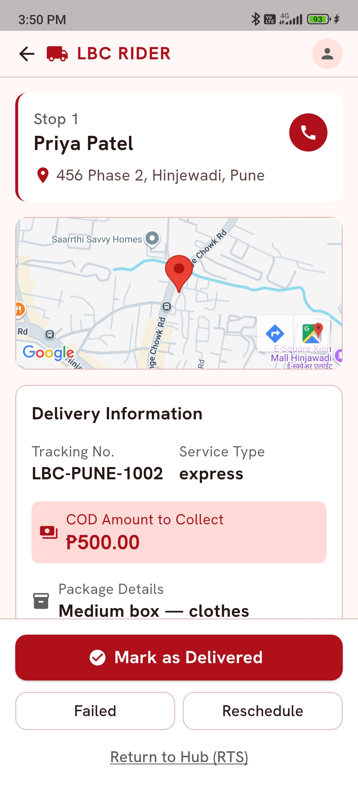

> ⚠️ **CRITICAL:** Every order on your manifest must be closed with one of the four outcomes before you finish your shift. Pending stops with unresolved status block sign-out and create paperwork at the hub.

---

## 4. Handling Field Exceptions

These protocols protect your earnings, your record, and most importantly, the parcel.

### 4.1 Customer Unavailable / No-Show — Failed Attempt

1. When you arrive and the customer is not present, tap the round **Call** button (phone icon) on the **Stop Detail** screen. Let it ring for at least **30 seconds**.
2. Wait a reasonable interval — typically **5 minutes** — at or near the address. Attempt to call again at the **2-minute** and **4-minute** marks.
3. If there is still no response, open the **Delivery Failed** screen and complete it:
  - **Reason:** select **Customer not available** (or **Address not found**, **Customer refused**, **Incorrect address**, or **Other** as appropriate).
  - **Notes:** add a short typed note describing the situation.
  - **Photo:** capture a photo of the location as proof you were at the address.
  - **Next Action:** select **Keep in Route (Retry Later)**.
  - Tap **Submit**.
4. The order's **attempt counter** increments (e.g., **Attempt 1 of 3**) and the app routes you to the next pending stop.

> ⚠️ **CRITICAL:** **Automatic RTS after 3 attempts.** Once any order accumulates **3 failed attempts**, the system automatically marks it **Return to Hub (RTS)** — you will not be assigned a 4th attempt, and the parcel returns to the origin.

> 💡 **Tip:** A reasonable wait at the address is part of your tracked service time. Leaving immediately on the first no-answer can be flagged as a premature failure.

### 4.2 Rescheduling a Delivery

Use **Reschedule** only when the customer is reachable (in person or by phone) and explicitly asks for a different date or time.

1. From the **Stop Detail** screen, open the **Delivery Failed** screen.
2. Pick the most appropriate **Reason** (typically **Other** with a clarifying note).
3. Add a **Note** with the customer's specific request (e.g., *"Customer at work weekdays; requested Saturday delivery"*).
4. Optionally capture a **Photo**.
5. Under **Next Action**, select **Reschedule Delivery**.
6. Tap **Submit**. The order is rebooked and moved off your current manifest.

> 💡 **Tip:** A reschedule does **not** count toward the 3-attempt RTS limit, so it is the right tool when the customer simply needs a different day — not when they are unreachable.

### 4.3 Return to Hub (RTS)

Use **RTS** for parcels that should not be reattempted from the field — damaged items, outright refusals, non-existent addresses, or orders you have decided to stop attempting.

1. From the **Stop Detail** screen, open the **Delivery Failed** screen.
2. Select a **Reason** that matches the situation (e.g., **Customer refused**, **Incorrect address**, or **Other** with a note like *"Damaged in transit"*).
3. Tap **Take Photo** and capture **2–3 clear photos** if damage or an address issue is the reason.
4. Under **Next Action**, select **Return to Hub (RTS)**.
5. Tap **Submit**. The parcel stays in your delivery bag — you will return it at the hub at end of trip (see [Section 5.1](#51-returning-to-the-hub--rts-handover)).

### 4.4 Damaged Packages (at the Hub)

Before adding a parcel to your manifest, inspect it. If you find damage:

1. **Do not scan or manually add the parcel to your manifest.**
2. Flag the damage to hub staff in person and have them take custody before you proceed.

> ⚠️ **CRITICAL:** **Never** add a visibly damaged parcel to your manifest. Once it is on your manifest, you become liable for its condition.

### 4.5 Damaged Packages (Discovered in Transit)

If a parcel is damaged after you have left the hub — e.g., during transport in the delivery box — use the **RTS** workflow on the **Delivery Failed** screen for that stop:

1. From the stop's **Stop Detail** screen, open the **Delivery Failed** screen.
2. Pick a **Reason** (typically **Other**) and add a **Note** describing the damage.
3. Capture **2–3 photos** of the damage from different angles using the **Photo** card.
4. Under **Next Action**, select **Return to Hub (RTS)**.
5. Tap **Submit**. Return the parcel at the hub with your other RTS items.

### 4.6 App Offline Mode

The **LBC Rider** app is built for the real world — including dead zones, basements, and rural roads.

**What works offline:**

- Signing in with your **PIN** (already-cached credentials)
- Tapping **Sync Orders** is disabled, but the **cached list** from your last sync is still readable
- Adding orders to the manifest by **scan** or **manual entry** (manual entry uses the cached list)
- Viewing your **Sequence** and **Deliveries** tabs (data from when the manifest was created)
- The 100 m **arrival GPS check** at each stop (GPS does not need cell service)
- Capturing **signatures**, **POD photos**, and submitting outcomes (**Delivered**, **Failed**, **Reschedule**, **RTS**) — these are saved locally and queued

**What does NOT work offline:**

- **Creating a manifest** with **Create Manifest & Start** — requires live internet
- **Daily Attendance Check-In** — requires live internet
- **Live route re-optimization** — you continue on the route computed at creation time
- Calling the customer (voice needs cell service)
- Live API order lookups in manual entry (it falls back to the cached list)

**How offline sync works:**

1. When connection drops, the **Connectivity Banner** turns **amber** and reads **"Offline — changes will sync when connected"**.
2. Continue your trip normally. All arrivals, signatures, photos, and outcomes are saved **locally** on your phone.
3. As soon as your phone regains signal, a **blue** banner appears showing **"Back online — syncing `N` action(s)…"** and queued actions upload in the background.
4. If actions remain after the auto-sync, a **dark orange** banner reads **"`N` action(s) pending sync"** — they will retry automatically.
5. Do **not** force-close the app or restart your phone while the amber/blue/orange banners are showing — your queued data could be lost.

> ⚠️ **CRITICAL:** If the **"`N` action(s) pending sync"** banner stays visible for more than **15 minutes after you've returned to a known good signal area**, contact dispatch immediately before continuing — see [Section 7](#7-emergency--support). Sign-out will be blocked until queued actions sync.

> 💡 **Tip:** The **arrival GPS check** for each delivery works offline — your phone's GPS does not need cell service. So you can keep delivering through dead zones with full POD capture.

---

## 5. End of Trip, Shift Summary & Sign-Out

### 5.1 Returning to the Hub & RTS Handover

At the end of your route — or any time your manifest's stops are all resolved — head back to the hub.

1. Before you walk into the hub, confirm that **every stop on the Sequence tab shows a resolved status** (✅ delivered, ❌ failed, 📅 rescheduled, or 🔁 RTS). The **Deliveries** tab is a useful read-only summary.
2. Once on-site, hand over any **RTS** and undelivered parcels to hub staff at the **Returns Counter** following your hub's local SOP. The app does not currently enforce a separate returns-scan flow, but the parcels must be physically handed over and signed off by hub staff before you sign out.
3. If the **Connectivity Banner** still shows pending sync, wait at the hub on Wi-Fi until it clears — you do not want pending POD or failure submissions left on your phone overnight.

> ⚠️ **CRITICAL:** Walking off with an undelivered parcel — even an RTS one — is treated as a lost-parcel incident. Hand every parcel back to hub staff before you leave the building.

### 5.2 Today's Shift Summary

A live summary of your day is available any time on the **Profile** tab:

1. Tap **Profile** on the bottom nav.
2. Scroll to the **Today's Shift** card.
3. The card shows four tiles: **Total / Completed / Failed / Remaining** stops for today's manifest.

For a per-stop breakdown, switch to the **Deliveries** tab and filter by **Delivered**, **Failed**, **Returned**, or **Rescheduled**.

### 5.3 Past Manifests (Shift History)

1. On the **Profile** tab, scroll to the **Past Manifests** card.
2. Each row shows the **Manifest ID**, **Date**, and **Status** badge (Active / Completed / etc.).
3. Tap a row to expand a detailed breakdown: **Total**, **Completed**, **Failed**, and **completion rate** (with a progress bar).

> 💡 **Tip:** The Past Manifests view is your fastest way to spot a trend (e.g., several days of high failed-attempt counts in a particular zone) and raise it with your supervisor.

### 5.4 Signing Out

1. On the **Profile** tab, scroll to the bottom and tap **Sign Out** (red outlined button).
2. The app clears your session and returns to the **Sign In** / **Enter PIN** screen.

> 💡 **Tip:** Always sign out **at the hub** after handing over RTS parcels and after the connectivity banner has cleared. Signing out with pending sync actions can leave deliveries stuck on your phone.

---

## 6. Troubleshooting & Quick FAQ

### 6.1 Common Errors

| Issue                                                              | Likely Cause                                                                      | Fix                                                                                                                                             |
| ------------------------------------------------------------------ | --------------------------------------------------------------------------------- | ----------------------------------------------------------------------------------------------------------------------------------------------- |
| **"Too far from hub"** on the Attendance / Check-In screen         | You are outside the hub's GPS radius, or GPS is weak indoors                      | Step outside the hub's main door for clearer sky and tap **Try Again**. Confirm Location is set to **Always Allow**.                            |
| **"Session expired"** — PIN screen is replaced by the Sign In form | Your security token has expired; PIN alone is no longer enough                    | Enter your **Email** and **Password** on the **Sign In** screen. Your existing **4-digit PIN** is preserved — no need to set a new one.         |
| Forgot your 4-digit PIN                                            | PIN not remembered after time off                                                 | On the PIN screen, switch to **Sign In with Email & Password**, sign in, then set a new 4-digit PIN when prompted.                              |
| **"Too Far From Stop"** modal when tapping **Arrived**             | You are more than 100 m from the address                                          | Tap **Move Closer** and walk to the address, OR pick an **Override Reason** if one of the four reasons legitimately applies.                    |
| **"Internet required to create manifest"** on the Scan screen      | No data connection                                                                | Move to a known signal spot (often near the hub's main entrance) or connect to the hub Wi-Fi, then tap **Create Manifest & Start** again.       |
| **"Sequence" / "Deliveries"** tabs are greyed out                  | You have not yet created a manifest                                               | Go to **Home** → tap **Create Manifest** → scan parcels → tap **Create Manifest & Start**. The two tabs unlock automatically.                   |
| **"Internet required to sync"** under the Sync Orders button       | No data connection                                                                | Reconnect to internet (mobile data or hub Wi-Fi); the button enables itself again.                                                              |
| Barcode won't scan                                                 | Glare, low light, damaged barcode                                                 | Tilt phone 15°. If still failing, tap **Manual Entry** and pick from the autocomplete list.                                                     |
| Manual entry autocomplete is empty                                 | You are offline and have not synced orders, or the order is not in the hub's list | Return to the hub or get back online, tap **Sync Orders** on the Home tab again, then retry.                                                    |
| App keeps crashing                                                 | Outdated version or low storage                                                   | Open **Play Store → LBC Rider → Update**. Free at least **1 GB** of phone storage.                                                              |
| **"No internet connection"** stuck on screen                       | Carrier outage or poor signal                                                     | Toggle **Airplane Mode** ON for 5 seconds, then OFF. If unresolved, use hub Wi-Fi for the next online-only step.                                |
| Connectivity banner stuck on **"`N` action(s) pending sync"**      | Background sync hasn't auto-flushed yet                                           | Wait a minute on stable signal. If it persists for 5+ minutes, sign out is blocked — contact dispatch (see [Section 7](#7-emergency--support)). |
| Notifications not arriving                                         | Battery optimization killing the app                                              | **Settings → Apps → LBC Rider → Battery → Unrestricted**.                                                                                       |

### 6.2 Quick FAQ

**Q: How much mobile data does the app use?**
A: Roughly **80–150 MB per 8-hour shift** with active navigation handled by Google Maps / Waze. The LBC Rider app itself is lightweight (~20 MB/shift) because most heavy data is downloaded once at the hub. A 3 GB monthly plan is more than enough for full-time riding.

**Q: How can I save battery during a long shift?**  
A: 1) Lower screen brightness to ~50%. 2) Close all other apps. 3) Use a dark phone wallpaper. 4) Keep the phone out of direct sunlight. 5) Always carry a 10,000 mAh power bank and a vehicle USB charger.

**Q: What happens if I lose signal right before tapping "Create Manifest & Start"?**
A: Your scanned list is preserved locally on the Scan screen — it is **not** lost. The button stays disabled until you have signal. Move to a known signal spot at the hub and tap **Create Manifest & Start** again.

**Q: Can I change the order of stops on the optimized route?**
A: Yes, but only when justified. On the **Sequence** tab, tap **Reorder** to drag stops, or tap **Optimize** to re-run server-side route optimization, then **Save Order**. Don't reorder without a customer-driven reason — it can delay other stops on your manifest.

**Q: How often will I be asked for my email and password instead of my PIN?**  
A: Only when your **session token expires** — typically after a long stretch of not opening the app, an app update, or a manual logout by dispatch. On normal day-to-day shifts you should only ever see the **PIN screen**. Your existing PIN is preserved across token refreshes, so you do not need to set a new one.

**Q: What if my phone dies mid-trip?**
A: Plug into your power bank, restart, and re-open **LBC Rider**. Your active trip will resume exactly where you left off, including any queued offline outcomes.

**Q: A customer's parcel has failed 2 times. What happens on attempt 3?**
A: Attempt 3 behaves like any other attempt — call, wait 5 minutes, deliver or mark Failed. If it fails again, the system automatically converts the order to **RTS** for the next pickup from the hub. You will not be assigned a 4th attempt.

---

## 7. Emergency & Support

This release of **LBC Rider** does **not** include an in-app SOS button or an in-app emergency dispatch flow. In any emergency, use your phone's standard call function and contact LBC dispatch directly via the hotline below.

### 7.1 In a Life-Threatening Emergency

If you are in immediate physical danger — accident, medical emergency, threat to your safety, or a serious vehicle breakdown in an unsafe area:

1. **Move to safety first** — get off the road if possible.
2. **Call your local emergency number** (e.g., **911 / 112 / national equivalent**) for first responders.
3. **Call the LBC Driver Hotline** (see [7.2](#72-driver-hotline--dispatch-support)) to inform dispatch and request operational support (parcel reassignment, vehicle recovery, family contact, etc.).
4. Stay at the scene until first responders or dispatch advises otherwise.

> ⚠️ **CRITICAL:** Your phone's standard emergency dial-out is your fastest route to first responders. Do **not** rely on in-app messaging in a life-threatening situation.

### 7.2 Driver Hotline & Dispatch Support

For everything from address questions to app glitches to genuine emergencies, contact LBC through one of these channels.

| Channel                              | When to use                                                                        | How to reach                                                                     |
| ------------------------------------ | ---------------------------------------------------------------------------------- | -------------------------------------------------------------------------------- |
| **Driver Hotline** ☎️                | Any urgent issue, including emergencies and active-trip blockers                   | `**[Insert Hotline Number, e.g., +63-2-8888-LBC1]`** — 24/7                      |
| **Hub Dispatcher (in-person)** 🧑‍✈️ | At the start or end of a shift, for parcel disputes, RTS handover, manifest issues | Your hub's dispatch desk                                                         |
| **Email Support** ✉️                 | Non-urgent: payout disputes, document uploads, account changes                     | `**[Insert Support Email, e.g., riders@lbc.example]`** — replies within 24 hours |
| **In-App AI Assistant** 🤖           | App usage questions (e.g., *"How do I mark a stop failed?"*)                       | Tap the floating sparkle button on the **Sequence** tab                          |

> ⚠️ **CRITICAL:** The **AI Assistant** is for app questions only. It is **not** a dispatch line. For any operational or emergency issue, call the Driver Hotline.

### 7.3 Reporting an Accident

If you are involved in any traffic accident — even a minor one — while on an active trip:

1. **Ensure your own safety first.** Move to the side of the road if possible.
2. If injured or in danger, call your local emergency number for first responders (see [7.1](#71-in-a-life-threatening-emergency)).
3. Once safe, **call the Driver Hotline** to report the accident to LBC dispatch.
4. While on the phone with dispatch (or as soon as you can):
  - Take **at least 4 photos**: your vehicle, the other party / scene, the road, any injuries — using your phone's standard camera.
  - Note the **other party's name, phone number, and plate number**.
  - Note the **time and location** of the incident.
5. Follow dispatch's instructions. They will decide whether to reassign your remaining stops and arrange any vehicle recovery.

> ⚠️ **CRITICAL:** Do **NOT** continue your trip after an accident, even if you feel fine and your vehicle looks okay. Pause where you are, contact dispatch, and let them decide next steps. Your safety and any insurance claim depend on stopping immediately.

---

## Appendix: Glossary of Key Terms

| Term                        | Meaning                                                                                                                                                                            |
| --------------------------- | ---------------------------------------------------------------------------------------------------------------------------------------------------------------------------------- |
| **Hub**                     | An LBC warehouse / sorting facility where you start and end every shift.                                                                                                           |
| **Attendance / Check-In**   | The GPS-verified hub check-in step that runs the first time you sign in each day. Required before the **Home** tab unlocks.                                                        |
| **Sync Orders**             | The action of pulling the latest hub-available-orders list onto your phone for offline use. Powers manual-entry autocomplete when offline.                                         |
| **Manifest**                | The list of orders you are physically carrying on a trip. Created by the **Create Manifest & Start** button on the Scan screen (internet required).                                |
| **Create Manifest & Start** | The single online action that submits your manifest, runs route optimization, and starts your trip.                                                                                |
| **Optimized Route**         | The server-computed sequence of stops for your trip, visible on the **Sequence** tab.                                                                                              |
| **POD**                     | Proof of Delivery — the signature and photo captured at drop-off on the **Stop Detail** / Delivery Success screen.                                                                 |
| **Failed Attempt**          | A delivery that could not be completed. After **3 attempts**, the order auto-converts to **RTS**.                                                                                  |
| **Reschedule**              | Customer-requested future delivery date. Does **not** count toward the 3-attempt limit.                                                                                            |
| **RTS**                     | Return to Hub. Used for damaged, refused, non-existent-address, or stop-attempting parcels.                                                                                        |
| **Geofence Check**          | The GPS verification that runs at hub check-in and at each delivery (within 100 m).                                                                                                |
| **Geofence Override**       | The "Too Far From Stop" override that lets you proceed with POD when GPS says you're more than 100 m from the address. Reasons are logged for dispatch review.                     |
| **4-digit PIN**             | The personal PIN you set on first sign-in. Used for daily PIN-only sign-in.                                                                                                        |
| **Session Token**           | The security credential the app uses after a successful email + password sign-in. While valid, only the PIN is needed; once expired, you must sign in with email + password again. |
| **AI Assistant**            | The floating sparkle button on the **Sequence** tab. Used for app-usage questions — **not** for dispatch or emergencies.                                                           |
| **Connectivity Banner**     | The amber / blue / dark-orange strip under the top app bar that signals offline / syncing / pending-sync states.                                                                   |

---

**Document version:** 1.3
**Last reviewed:** `[Insert Review Date]`
**Owner:** LBC Rider Operations
**Feedback:** Found something unclear or out of date? Raise it with your dispatcher or email `**[Insert Support Email]`**.

> Ride safe. Deliver smart. — *The LBC Rider Team*

